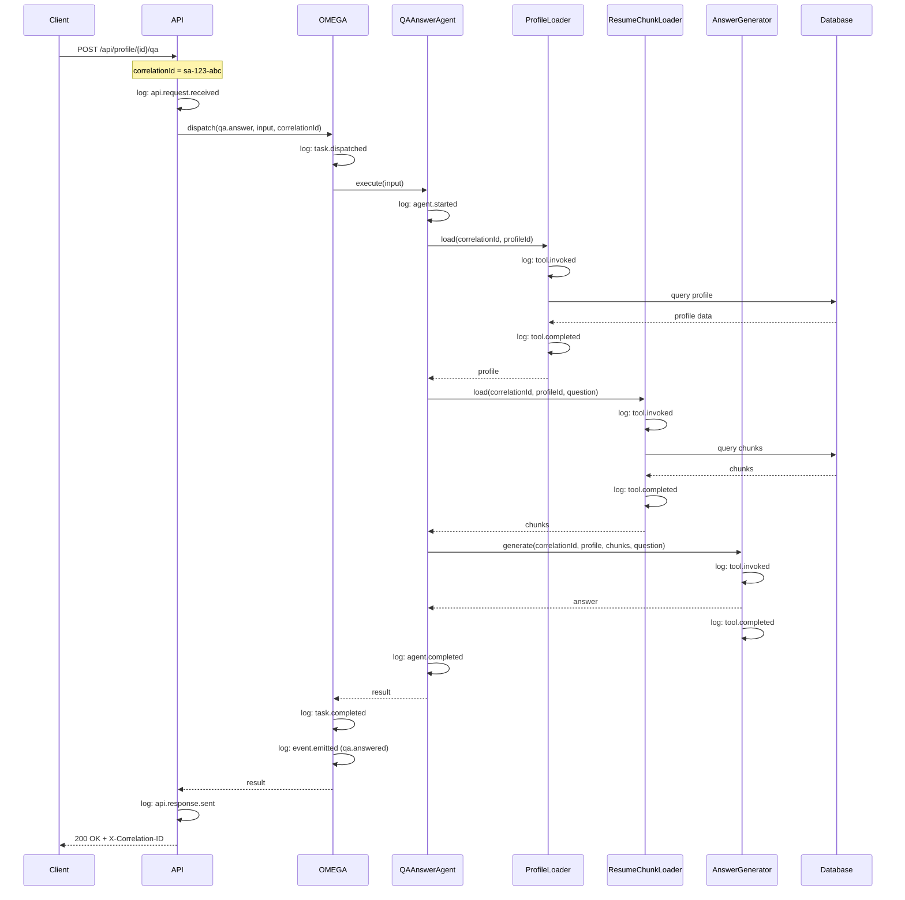
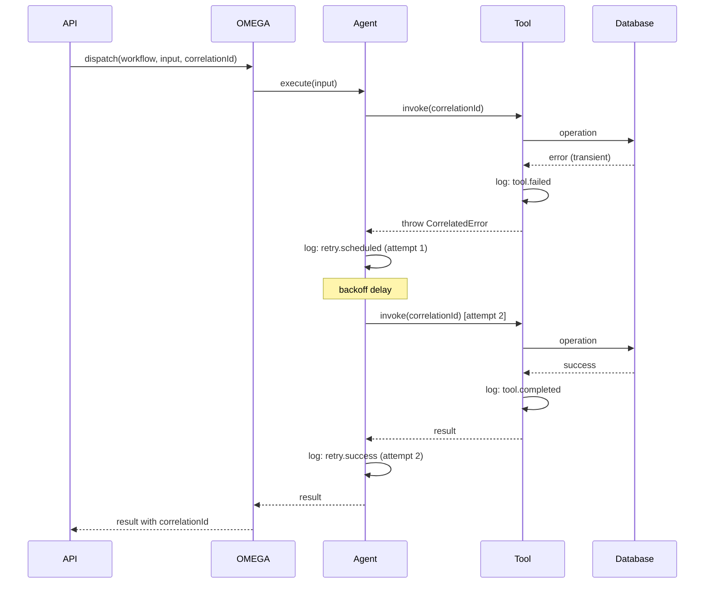

# SilentApply Correlation Threading Plan (OMEGA SDK)

This document defines how correlation flows through the entire SilentApply request lifecycle, ensuring end-to-end traceability across async boundaries, error scenarios, and retries.

---

## Correlation ID Specification

### Format

```
sa-{timestamp}-{random}
```

**Components**:
- `sa`: SilentApply prefix
- `timestamp`: Unix epoch milliseconds (13 digits)
- `random`: 8 character alphanumeric random string

**Example**: `sa-1706123456789-a1b2c3d4`

### Generation Rules

| Layer | Responsibility |
|-------|---------------|
| API Gateway | Generate correlation ID if not present in request |
| API Layer | Accept correlation ID from header, or generate new |
| OMEGA Task Dispatch | Propagate correlation ID from API |
| Agents | Receive and propagate correlation ID |
| Tools | Receive and propagate correlation ID |

### HTTP Header

```
X-Correlation-ID: sa-1706123456789-a1b2c3d4
```

If the incoming request includes `X-Correlation-ID`, use it.
Otherwise, generate a new one at the API entry point.

---

## End-to-End Flow

### Request Lifecycle

```
[Client Request]
      |
      | X-Correlation-ID: (optional)
      v
[API Gateway / Edge]
      |
      | correlationId = header || generate()
      v
[API Route Handler]
      |
      | log: api.request.received { correlationId }
      v
[OMEGA Task Dispatch]
      |
      | taskId = dispatch(workflow, input, correlationId)
      | log: task.dispatched { correlationId, taskId }
      v
[Agent Invocation]
      |
      | log: agent.started { correlationId, agentName }
      v
[Tool Call(s)]
      |
      | log: tool.invoked { correlationId, toolName }
      | log: tool.completed { correlationId, toolName, durationMs }
      v
[Agent Response]
      |
      | log: agent.completed { correlationId, agentName, status }
      v
[Task Completion]
      |
      | log: task.completed { correlationId, taskId, status }
      v
[API Response]
      |
      | X-Correlation-ID: sa-1706123456789-a1b2c3d4
      | log: api.response.sent { correlationId, statusCode }
      v
[Client]
```

---

## Correlation Propagation by Layer

### 1. API Request -> OMEGA Task Dispatch

```typescript
// API Route Handler (e.g., /api/profile/[id]/qa)
export async function POST(request: Request) {
  // Extract or generate correlation ID
  const correlationId = request.headers.get("X-Correlation-ID")
    ?? generateCorrelationId();

  // Log request receipt
  logger.info({
    event: "api.request.received",
    correlationId,
    path: "/api/profile/[id]/qa",
    method: "POST"
  });

  // Parse input
  const body = await request.json();
  const input: QAAnswerInput = {
    correlationId,
    profileId: params.id,
    question: body.question,
    recruiterEmail: body.email,
    recruiterName: body.name
  };

  // Dispatch to OMEGA
  const taskId = await omega.dispatch("qa.answer", input);

  logger.info({
    event: "task.dispatched",
    correlationId,
    taskId,
    workflow: "qa.answer"
  });

  // Wait for completion or return task reference
  const result = await omega.awaitResult(taskId);

  // Return response with correlation header
  return new Response(JSON.stringify(result), {
    headers: {
      "X-Correlation-ID": correlationId,
      "Content-Type": "application/json"
    }
  });
}
```

### 2. Task -> Agent Invocation

```typescript
// OMEGA Task Executor
async function executeTask(task: Task) {
  const { correlationId, workflow, input } = task;

  logger.info({
    event: "task.started",
    correlationId,
    taskId: task.id,
    workflow
  });

  // Invoke appropriate agent
  const agent = getAgent(workflow);

  const result = await agent.execute({
    correlationId,
    ...input
  });

  logger.info({
    event: "task.completed",
    correlationId,
    taskId: task.id,
    workflow,
    status: result.status
  });

  return result;
}
```

### 3. Agent -> Tool Calls

```typescript
// QAAnswerAgent
class QAAnswerAgent {
  async execute(input: QAAnswerInput): Promise<QAAnswerOutput> {
    const { correlationId, profileId, question } = input;

    logger.info({
      event: "agent.started",
      correlationId,
      agentName: "QAAnswerAgent"
    });

    // Tool call 1: Load profile
    const profile = await this.profileLoader.load({
      correlationId,
      profileId
    });

    // Tool call 2: Load resume chunks
    const chunks = await this.resumeChunkLoader.load({
      correlationId,
      profileId,
      query: question
    });

    // Tool call 3: Generate answer
    const answer = await this.answerGenerator.generate({
      correlationId,
      profile,
      chunks,
      question
    });

    logger.info({
      event: "agent.completed",
      correlationId,
      agentName: "QAAnswerAgent",
      status: answer.type
    });

    return {
      correlationId,
      status: answer.type,
      answer: answer.text
    };
  }
}
```

### 4. Tool Response -> Task Completion

```typescript
// ProfileLoader Tool
class ProfileLoader {
  async load(input: { correlationId: string; profileId: string }) {
    const { correlationId, profileId } = input;
    const startTime = Date.now();

    logger.info({
      event: "tool.invoked",
      correlationId,
      toolName: "ProfileLoader",
      input: { profileId }
    });

    try {
      const profile = await db.profile.findUnique({
        where: { id: profileId, published: true }
      });

      const durationMs = Date.now() - startTime;

      logger.info({
        event: "tool.completed",
        correlationId,
        toolName: "ProfileLoader",
        durationMs,
        found: !!profile
      });

      if (!profile) {
        throw new NotFoundError("PROFILE_NOT_FOUND");
      }

      return profile;
    } catch (error) {
      const durationMs = Date.now() - startTime;

      logger.error({
        event: "tool.failed",
        correlationId,
        toolName: "ProfileLoader",
        durationMs,
        errorCode: error.code,
        errorMessage: error.message
      });

      throw error;
    }
  }
}
```

### 5. Task Completion -> API Response/Webhook

```typescript
// Task completion handler
async function onTaskComplete(task: Task, result: any) {
  const { correlationId } = task;

  logger.info({
    event: "task.result.ready",
    correlationId,
    taskId: task.id,
    status: result.status
  });

  // If webhook configured, send notification
  if (task.webhookUrl) {
    await sendWebhook({
      url: task.webhookUrl,
      payload: {
        correlationId,
        taskId: task.id,
        status: result.status,
        result
      },
      headers: {
        "X-Correlation-ID": correlationId
      }
    });

    logger.info({
      event: "webhook.sent",
      correlationId,
      taskId: task.id,
      webhookUrl: task.webhookUrl
    });
  }

  return result;
}
```

---

## Correlation Survival Scenarios

### Scenario 1: Async Boundaries

Correlation survives async task dispatch and await:

```
[Sync API Handler]
    |
    | correlationId = "sa-123-abc"
    v
[Task Dispatch] ---------> [Task Queue]
    |                           |
    | (immediate return)        | (async processing)
    v                           v
[Polling/Await]            [Task Executor]
    |                           |
    |                           | correlationId = "sa-123-abc"
    |                           v
    |                      [Agent Execution]
    |                           |
    |                           | correlationId = "sa-123-abc"
    |                           v
    +<---- result ----------[Task Complete]
    |
    | correlationId = "sa-123-abc" (echoed in response)
    v
[API Response]
```

**Implementation**:
```typescript
// Task queue entry includes correlationId
interface QueuedTask {
  id: string;
  correlationId: string;  // Preserved across async boundary
  workflow: string;
  input: any;
  createdAt: string;
}
```

### Scenario 2: Error Scenarios

Correlation survives through error handling:

```
[Agent Execution]
    |
    | correlationId = "sa-123-abc"
    v
[Tool Call] -----> [Error Thrown]
    |                   |
    |                   | error includes correlationId
    |                   v
    |              [Error Handler]
    |                   |
    |                   | log: { correlationId, errorCode }
    |                   v
    |              [Retry Decision]
    |                   |
    +<--retry----------+--no retry--> [Failure Response]
    |                                      |
    | correlationId preserved              | correlationId = "sa-123-abc"
    v                                      v
[Retry Attempt]                      [API Error Response]
```

**Implementation**:
```typescript
// Custom error class preserves correlation
class CorrelatedError extends Error {
  constructor(
    public correlationId: string,
    public code: string,
    message: string,
    public retriable: boolean = false
  ) {
    super(message);
  }
}

// Error handler maintains correlation
function handleError(error: CorrelatedError) {
  logger.error({
    event: "error.occurred",
    correlationId: error.correlationId,
    errorCode: error.code,
    errorMessage: error.message,
    retriable: error.retriable
  });

  if (error.retriable) {
    return scheduleRetry(error.correlationId);
  }

  return {
    correlationId: error.correlationId,
    status: "failure",
    error: {
      code: error.code,
      message: error.message
    }
  };
}
```

### Scenario 3: Retries

Correlation persists across retry attempts:

```
[Attempt 1]
    |
    | correlationId = "sa-123-abc"
    | attemptNumber = 1
    v
[Tool Call] -----> [Transient Error]
    |                   |
    |                   v
    |              [Retry Scheduled]
    |                   |
    |                   | log: { correlationId, attemptNumber: 1 }
    v                   v
[Attempt 2]
    |
    | correlationId = "sa-123-abc"  (same)
    | attemptNumber = 2
    v
[Tool Call] -----> [Success]
    |
    | log: { correlationId, attemptNumber: 2, status: "success" }
    v
[Complete]
```

**Implementation**:
```typescript
// Retry context preserves correlation and tracks attempts
interface RetryContext {
  correlationId: string;
  attemptNumber: number;
  maxAttempts: number;
  lastError?: string;
}

async function executeWithRetry<T>(
  context: RetryContext,
  operation: () => Promise<T>
): Promise<T> {
  const { correlationId, attemptNumber, maxAttempts } = context;

  logger.info({
    event: "retry.attempt",
    correlationId,
    attemptNumber,
    maxAttempts
  });

  try {
    const result = await operation();

    logger.info({
      event: "retry.success",
      correlationId,
      attemptNumber
    });

    return result;
  } catch (error) {
    logger.warn({
      event: "retry.failed",
      correlationId,
      attemptNumber,
      errorCode: error.code,
      errorMessage: error.message
    });

    if (attemptNumber >= maxAttempts || !error.retriable) {
      throw error;
    }

    const delay = calculateBackoff(attemptNumber);
    await sleep(delay);

    return executeWithRetry(
      { ...context, attemptNumber: attemptNumber + 1 },
      operation
    );
  }
}
```

---

## Correlation in Events

### Event Schema

All events include correlation ID:

```typescript
interface BaseEvent {
  eventType: string;
  correlationId: string;
  timestamp: string;
  metadata?: Record<string, any>;
}

// Example events
interface QAAnsweredEvent extends BaseEvent {
  eventType: "qa.answered";
  profileId: string;
  qaRecordId: string;
}

interface BookingConfirmedEvent extends BaseEvent {
  eventType: "booking.confirmed";
  profileId: string;
  bookingId: string;
  recruiterNotified: boolean;
  candidateNotified: boolean;
}
```

### Event Logging

```typescript
function emitEvent(event: BaseEvent) {
  logger.info({
    event: "event.emitted",
    correlationId: event.correlationId,
    eventType: event.eventType,
    payload: event
  });

  // Publish to event bus if configured
  eventBus.publish(event);
}
```

---

## Correlation Lookup and Debugging

### Query by Correlation ID

All logs can be queried by correlation ID:

```
// Azure Log Analytics / Application Insights query
traces
| where customDimensions.correlationId == "sa-1706123456789-a1b2c3d4"
| order by timestamp asc
```

### Expected Log Sequence

For a successful `qa.answer` request:

```
1. api.request.received    { correlationId, path: "/api/profile/[id]/qa" }
2. task.dispatched         { correlationId, taskId, workflow: "qa.answer" }
3. task.started            { correlationId, taskId }
4. agent.started           { correlationId, agentName: "QAAnswerAgent" }
5. tool.invoked            { correlationId, toolName: "ProfileLoader" }
6. tool.completed          { correlationId, toolName: "ProfileLoader", durationMs }
7. tool.invoked            { correlationId, toolName: "ResumeChunkLoader" }
8. tool.completed          { correlationId, toolName: "ResumeChunkLoader", durationMs }
9. tool.invoked            { correlationId, toolName: "AnswerGenerator" }
10. tool.completed         { correlationId, toolName: "AnswerGenerator", durationMs }
11. agent.completed        { correlationId, agentName: "QAAnswerAgent", status }
12. task.completed         { correlationId, taskId, status }
13. event.emitted          { correlationId, eventType: "qa.answered" }
14. api.response.sent      { correlationId, statusCode: 200 }
```

---

## Correlation Context Object

### TypeScript Interface

```typescript
interface CorrelationContext {
  correlationId: string;
  taskId?: string;
  agentName?: string;
  attemptNumber?: number;
  startTime: number;
}

// Context propagation using AsyncLocalStorage (Node.js)
import { AsyncLocalStorage } from "async_hooks";

const correlationStorage = new AsyncLocalStorage<CorrelationContext>();

function withCorrelation<T>(
  context: CorrelationContext,
  fn: () => Promise<T>
): Promise<T> {
  return correlationStorage.run(context, fn);
}

function getCorrelation(): CorrelationContext | undefined {
  return correlationStorage.getStore();
}

// Usage in logger
const logger = {
  info(data: Record<string, any>) {
    const context = getCorrelation();
    console.log(JSON.stringify({
      ...data,
      correlationId: context?.correlationId,
      taskId: context?.taskId,
      timestamp: new Date().toISOString()
    }));
  }
};
```

---

## Correlation Flow Diagrams

### qa.answer Complete Flow



### Error Flow with Retry



---

## Summary

| Aspect | Specification |
|--------|---------------|
| Format | `sa-{timestamp}-{random}` |
| Generation | API layer (if not in header) |
| HTTP Header | `X-Correlation-ID` |
| Propagation | All layers, all tool calls |
| Async Survival | Preserved in task queue |
| Error Survival | Included in error objects |
| Retry Survival | Same ID across all attempts |
| Event Inclusion | Required field in all events |
| Queryability | Single ID retrieves full trace |
