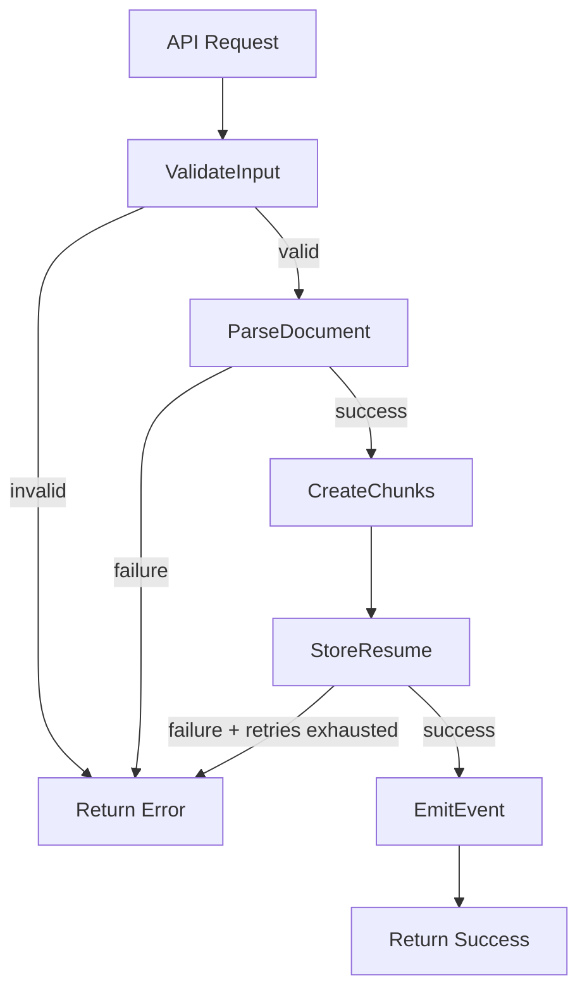
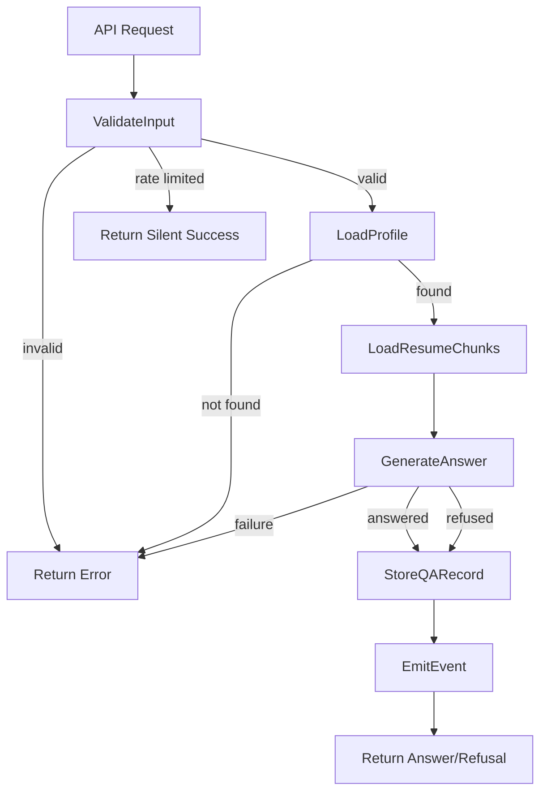
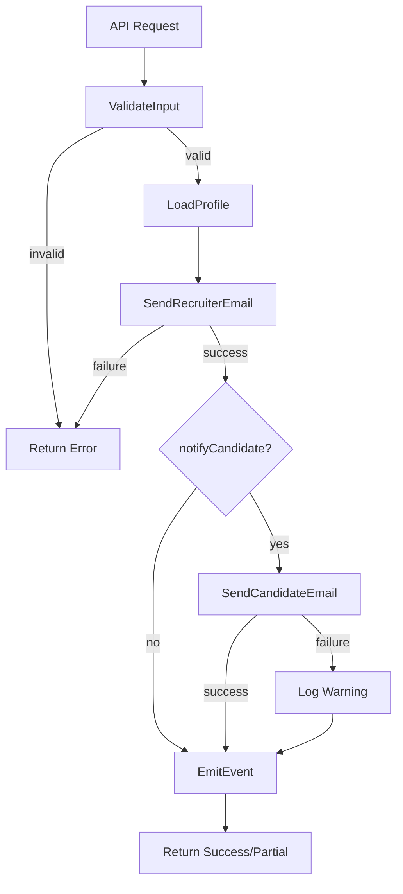

# SilentApply Task DAG Specifications (OMEGA SDK)

This document defines the task DAGs for SilentApply MVP workflows.
All workflows use OMEGA SDK patterns with linear DAGs where possible.

---

## Design Principles

1. **Linear DAGs Preferred**: Sequential steps reduce complexity and improve debuggability
2. **Explicit Steps**: Each step has clear input/output contracts
3. **Correlation Threading**: All steps propagate correlationId
4. **Idempotency**: Steps are safe to retry
5. **Fail Fast**: Non-retriable errors halt the DAG immediately

---

## 1. resume.ingest

### Purpose
Process an uploaded resume file, extract text, create searchable chunks, and store in database.

### Trigger
API call to `POST /api/profile/{profileId}/resume`

### Input Schema

```typescript
interface ResumeIngestInput {
  correlationId: string;      // Generated by API layer
  profileId: string;          // Candidate profile ID
  fileReference: {
    blobUrl: string;          // Azure Blob Storage URL
    fileName: string;         // Original file name
    contentType: string;      // MIME type
    sizeBytes: number;        // File size
  };
  fileType: "pdf" | "docx";   // Detected format
}
```

### DAG Steps

```
[Step 1: ValidateInput]
        |
        v
[Step 2: ParseDocument]
        |
        v
[Step 3: CreateChunks]
        |
        v
[Step 4: StoreResume]
        |
        v
[Step 5: EmitEvent]
```

#### Step 1: ValidateInput

| Property | Value |
|----------|-------|
| **Agent** | None (inline validation) |
| **Tool** | None |
| **Action** | Validate fileReference exists, profileId is valid, fileType is supported |
| **On Success** | Proceed to Step 2 |
| **On Failure** | Halt DAG, return `VALIDATION_FAILED` |

**Input**: `ResumeIngestInput`

**Output**:
```typescript
interface ValidateInputOutput {
  correlationId: string;
  valid: true;
}
```

#### Step 2: ParseDocument

| Property | Value |
|----------|-------|
| **Agent** | ResumeIngestAgent |
| **Tool** | DocumentParser |
| **Action** | Extract text content from PDF/DOCX |
| **On Success** | Proceed to Step 3 |
| **On Failure** | Halt DAG if non-retriable, retry if retriable |

**Input**: `fileReference`, `fileType`

**Output**:
```typescript
interface ParseDocumentOutput {
  correlationId: string;
  rawText: string;
  pageCount: number;
  metadata: {
    title?: string;
    author?: string;
    createdAt?: string;
  };
}
```

#### Step 3: CreateChunks

| Property | Value |
|----------|-------|
| **Agent** | ResumeIngestAgent |
| **Tool** | None (inline chunking logic) |
| **Action** | Split text into semantic chunks for RAG retrieval |
| **On Success** | Proceed to Step 4 |
| **On Failure** | Halt DAG |

**Input**: `rawText` from Step 2

**Output**:
```typescript
interface CreateChunksOutput {
  correlationId: string;
  chunks: Array<{
    index: number;
    content: string;
    charStart: number;
    charEnd: number;
  }>;
  totalChunks: number;
}
```

**Chunking Strategy**:
- Target chunk size: 500-800 characters
- Overlap: 100 characters
- Preserve paragraph boundaries where possible
- No semantic analysis (deterministic chunking only)

#### Step 4: StoreResume

| Property | Value |
|----------|-------|
| **Agent** | ResumeIngestAgent |
| **Tool** | Database write |
| **Action** | Store resume record and chunks in database |
| **On Success** | Proceed to Step 5 |
| **On Failure** | Retry up to 3 times, then halt |

**Input**: `profileId`, `rawText`, `chunks`, `metadata`

**Output**:
```typescript
interface StoreResumeOutput {
  correlationId: string;
  resumeId: string;
  chunkCount: number;
  storedAt: string;  // ISO 8601
}
```

**Idempotency**: Uses `profileId` + file hash as idempotency key. Re-uploads replace existing resume.

#### Step 5: EmitEvent

| Property | Value |
|----------|-------|
| **Agent** | None (inline event emission) |
| **Tool** | EventLogger |
| **Action** | Emit `resume.parsed` event |
| **On Success** | Complete DAG |
| **On Failure** | Log warning, complete DAG (non-blocking) |

**Event Schema**:
```typescript
interface ResumeIngestEvent {
  eventType: "resume.parsed";
  correlationId: string;
  profileId: string;
  resumeId: string;
  chunkCount: number;
  timestamp: string;
}
```

### Output Schema

```typescript
interface ResumeIngestOutput {
  correlationId: string;
  status: "success" | "failure";
  resumeId?: string;
  chunkCount?: number;
  error?: {
    code: string;
    message: string;
    step: string;
  };
}
```

### Error Handling

| Error Code | Step | Retriable | Action |
|------------|------|-----------|--------|
| `VALIDATION_FAILED` | 1 | No | Return error to API |
| `PARSE_FAILED` | 2 | No | Return error to API |
| `UNSUPPORTED_FORMAT` | 2 | No | Return error to API |
| `FILE_NOT_FOUND` | 2 | No | Return error to API |
| `STORAGE_ERROR` | 4 | Yes | Retry 3x, then fail |
| `TIMEOUT` | Any | Yes | Retry 3x, then fail |

---

## 2. qa.answer

### Purpose
Generate a bounded answer to a recruiter question using candidate-approved profile data and resume content.

### Trigger
API call to `POST /api/profile/{profileId}/qa`

### Input Schema

```typescript
interface QAAnswerInput {
  correlationId: string;      // Generated by API layer
  profileId: string;          // Candidate profile ID
  question: string;           // Recruiter question text
  recruiterEmail?: string;    // Optional for context
  recruiterName?: string;     // Optional for context
}
```

### DAG Steps

```
[Step 1: ValidateInput]
        |
        v
[Step 2: LoadProfile]
        |
        v
[Step 3: LoadResumeChunks]
        |
        v
[Step 4: GenerateAnswer]
        |
        v
[Step 5: StoreQARecord]
        |
        v
[Step 6: EmitEvent]
```

#### Step 1: ValidateInput

| Property | Value |
|----------|-------|
| **Agent** | None (inline validation) |
| **Tool** | None |
| **Action** | Validate profileId exists, question is non-empty, rate limits not exceeded |
| **On Success** | Proceed to Step 2 |
| **On Failure** | Halt DAG, return appropriate error |

**Input**: `QAAnswerInput`

**Output**:
```typescript
interface ValidateInputOutput {
  correlationId: string;
  valid: true;
}
```

**Rate Limit Check**:
- Redis key: `sa:qa:profile:{profileId}`
- Threshold: 10 questions / 15 minutes
- On limit exceeded: Return `RATE_LIMITED` silently (no error message to recruiter)

#### Step 2: LoadProfile

| Property | Value |
|----------|-------|
| **Agent** | QAAnswerAgent |
| **Tool** | ProfileLoader |
| **Action** | Load candidate profile data |
| **On Success** | Proceed to Step 3 |
| **On Failure** | Halt DAG if profile not found or unpublished |

**Input**: `profileId`

**Output**:
```typescript
interface LoadProfileOutput {
  correlationId: string;
  profile: {
    id: string;
    name: string;
    headline?: string;
    roles: string[];
    location?: string;
    workMode?: string;
    workAuthorization?: string;
    availability?: string;
    published: boolean;
  };
}
```

**Canon Enforcement**: If `published === false`, halt with `PROFILE_NOT_FOUND` (no distinction between unpublished and nonexistent).

#### Step 3: LoadResumeChunks

| Property | Value |
|----------|-------|
| **Agent** | QAAnswerAgent |
| **Tool** | ResumeChunkLoader |
| **Action** | Load relevant resume chunks for RAG retrieval |
| **On Success** | Proceed to Step 4 |
| **On Failure** | Proceed to Step 4 with empty chunks (resume optional) |

**Input**: `profileId`, `question`

**Output**:
```typescript
interface LoadResumeChunksOutput {
  correlationId: string;
  chunks: Array<{
    content: string;
    relevanceScore: number;
  }>;
  hasResume: boolean;
}
```

**Retrieval Strategy**:
- Vector similarity search on question embedding
- Top 3-5 most relevant chunks
- Minimum relevance threshold: 0.7
- If no resume exists, return empty array (non-blocking)

#### Step 4: GenerateAnswer

| Property | Value |
|----------|-------|
| **Agent** | QAAnswerAgent |
| **Tool** | AnswerGenerator |
| **Action** | Generate bounded answer via LLM |
| **On Success** | Proceed to Step 5 |
| **On Failure** | Retry up to 3 times, then halt |

**Input**: `profile`, `chunks`, `question`

**Output**:
```typescript
interface GenerateAnswerOutput {
  correlationId: string;
  answerType: "answered" | "refused";
  answer?: string;        // When answered
  refusalReason?: string; // When refused
}
```

**Canon Enforcement** (RECRUITER_Q&A_CANON_v1):

1. **System Prompt** includes:
   - Answering authority constraints
   - Forbidden sources list
   - Tone requirements
   - Out-of-scope detection criteria
   - Canon refusal responses

2. **Out-of-Scope Detection**:
   - Salary/compensation questions -> refuse
   - Personal questions -> refuse
   - Legal interpretations -> refuse
   - Predictions/guarantees -> refuse
   - Behavioral hypotheticals -> refuse

3. **Answer Validation**:
   - Check for forbidden phrases
   - Verify answer only references provided data
   - Maximum length: 500 characters

#### Step 5: StoreQARecord

| Property | Value |
|----------|-------|
| **Agent** | QAAnswerAgent |
| **Tool** | Database write |
| **Action** | Store Q&A record in database |
| **On Success** | Proceed to Step 6 |
| **On Failure** | Retry up to 3 times, then halt |

**Input**: `profileId`, `question`, `answer`, `answerType`

**Output**:
```typescript
interface StoreQARecordOutput {
  correlationId: string;
  qaRecordId: string;
  storedAt: string;
}
```

**Stored Fields**:
- Question text
- Answer text
- Answer type (answered/refused)
- Timestamp
- Profile ID
- Correlation ID

**Not Stored** (per Canon):
- Recruiter identity linkage
- Behavioral scoring
- Cross-profile tracking

#### Step 6: EmitEvent

| Property | Value |
|----------|-------|
| **Agent** | None (inline event emission) |
| **Tool** | EventLogger |
| **Action** | Emit `qa.answered` or `qa.refused` event |
| **On Success** | Complete DAG |
| **On Failure** | Log warning, complete DAG (non-blocking) |

**Event Schema**:
```typescript
interface QAAnswerEvent {
  eventType: "qa.answered" | "qa.refused";
  correlationId: string;
  profileId: string;
  qaRecordId: string;
  timestamp: string;
}
```

### Output Schema

```typescript
interface QAAnswerOutput {
  correlationId: string;
  status: "answered" | "refused" | "failure";
  answer?: string;
  refusalReason?: string;
  error?: {
    code: string;
    message: string;
    step: string;
  };
}
```

### Error Handling

| Error Code | Step | Retriable | Action |
|------------|------|-----------|--------|
| `VALIDATION_FAILED` | 1 | No | Return error to API |
| `RATE_LIMITED` | 1 | No | Return silent success (shadow suppression) |
| `PROFILE_NOT_FOUND` | 2 | No | Return error to API |
| `GENERATION_FAILED` | 4 | Yes | Retry 3x, then fail |
| `STORAGE_ERROR` | 5 | Yes | Retry 3x, then fail |
| `TIMEOUT` | Any | Yes | Retry 3x, then fail |

---

## 3. booking.notify

### Purpose
Send booking confirmation emails to recruiters and optionally notify candidates.

### Trigger
Booking confirmation via `POST /api/profile/{profileId}/booking/{slotId}/confirm`

### Input Schema

```typescript
interface BookingNotifyInput {
  correlationId: string;      // Generated by API layer
  bookingId: string;          // Booking record ID
  profileId: string;          // Candidate profile ID
  recruiterEmail: string;     // Recruiter email (required)
  recruiterName?: string;     // Optional
  slotStart: string;          // ISO 8601
  slotEnd: string;            // ISO 8601
  notifyCandidate: boolean;   // Whether to notify candidate
}
```

### DAG Steps

```
[Step 1: ValidateInput]
        |
        v
[Step 2: LoadProfile]
        |
        v
[Step 3: SendRecruiterEmail]
        |
        v
[Step 4: SendCandidateEmail] (conditional)
        |
        v
[Step 5: EmitEvent]
```

#### Step 1: ValidateInput

| Property | Value |
|----------|-------|
| **Agent** | None (inline validation) |
| **Tool** | None |
| **Action** | Validate booking exists, recruiterEmail is valid format, slot times are valid |
| **On Success** | Proceed to Step 2 |
| **On Failure** | Halt DAG, return appropriate error |

**Input**: `BookingNotifyInput`

**Output**:
```typescript
interface ValidateInputOutput {
  correlationId: string;
  valid: true;
}
```

#### Step 2: LoadProfile

| Property | Value |
|----------|-------|
| **Agent** | BookingNotifyAgent |
| **Tool** | ProfileLoader |
| **Action** | Load candidate profile for email content |
| **On Success** | Proceed to Step 3 |
| **On Failure** | Halt DAG |

**Input**: `profileId`

**Output**:
```typescript
interface LoadProfileOutput {
  correlationId: string;
  profile: {
    id: string;
    name: string;
    email: string;
    bookingNotificationsEnabled: boolean;
  };
}
```

#### Step 3: SendRecruiterEmail

| Property | Value |
|----------|-------|
| **Agent** | BookingNotifyAgent |
| **Tool** | EmailSender |
| **Action** | Send confirmation email to recruiter |
| **On Success** | Proceed to Step 4 |
| **On Failure** | Retry up to 3 times, then halt |

**Input**: `recruiterEmail`, `recruiterName`, `profile`, `slotStart`, `slotEnd`, `bookingId`

**Email Template**:
```
Subject: Booking confirmed with {candidateName}

A conversation has been scheduled.

Date: {formattedDate}
Time: {formattedTime}

To cancel or reschedule:
{cancelLink}

---
SilentApply
```

**Canon Enforcement** (BOOKING_CANON_v1):
- No urgency language
- No marketing content
- Factual and minimal
- Include cancel/reschedule link

**Output**:
```typescript
interface SendRecruiterEmailOutput {
  correlationId: string;
  sent: true;
  messageId: string;
}
```

#### Step 4: SendCandidateEmail (Conditional)

| Property | Value |
|----------|-------|
| **Agent** | BookingNotifyAgent |
| **Tool** | EmailSender |
| **Condition** | `notifyCandidate === true && profile.bookingNotificationsEnabled === true` |
| **Action** | Send notification email to candidate |
| **On Success** | Proceed to Step 5 |
| **On Failure** | Log warning, proceed to Step 5 (non-blocking) |

**Input**: `profile.email`, `recruiterName`, `slotStart`, `slotEnd`

**Email Template**:
```
Subject: A conversation has been scheduled

A recruiter has booked a conversation.

Date: {formattedDate}
Time: {formattedTime}
{recruiterName ? `With: ${recruiterName}` : ''}

To manage your availability:
{dashboardLink}

---
SilentApply
```

**Output**:
```typescript
interface SendCandidateEmailOutput {
  correlationId: string;
  sent: boolean;
  skipped: boolean;  // true if notifications disabled
  messageId?: string;
}
```

#### Step 5: EmitEvent

| Property | Value |
|----------|-------|
| **Agent** | None (inline event emission) |
| **Tool** | EventLogger |
| **Action** | Emit `booking.confirmed` event |
| **On Success** | Complete DAG |
| **On Failure** | Log warning, complete DAG (non-blocking) |

**Event Schema**:
```typescript
interface BookingNotifyEvent {
  eventType: "booking.confirmed";
  correlationId: string;
  profileId: string;
  bookingId: string;
  recruiterNotified: boolean;
  candidateNotified: boolean;
  timestamp: string;
}
```

### Output Schema

```typescript
interface BookingNotifyOutput {
  correlationId: string;
  status: "success" | "partial" | "failure";
  recruiterNotified: boolean;
  candidateNotified?: boolean;
  error?: {
    code: string;
    message: string;
    step: string;
  };
}
```

**Partial Success**: If recruiter email succeeds but candidate email fails, return `status: "partial"`.

### Error Handling

| Error Code | Step | Retriable | Action |
|------------|------|-----------|--------|
| `VALIDATION_FAILED` | 1 | No | Return error to API |
| `INVALID_EMAIL` | 1 | No | Return error to API |
| `PROFILE_NOT_FOUND` | 2 | No | Return error to API |
| `BOOKING_NOT_FOUND` | 1 | No | Return error to API |
| `EMAIL_SEND_FAILED` | 3 | Yes | Retry 3x, then fail |
| `CANDIDATE_EMAIL_FAILED` | 4 | No | Log warning, return partial |
| `TIMEOUT` | Any | Yes | Retry 3x, then fail |

---

## DAG Execution Patterns

### Sequential Execution

All DAGs execute steps sequentially:

```
Step N completes -> Step N+1 begins
```

No parallel step execution within a single DAG instance.

### Correlation Propagation

Every step receives and propagates `correlationId`:

```typescript
// Step invocation
await executeStep({
  correlationId: input.correlationId,
  stepName: "LoadProfile",
  input: { profileId: input.profileId }
});

// Tool invocation within step
await profileLoader.load({
  correlationId: input.correlationId,
  profileId: input.profileId
});
```

### Idempotency Keys

Each DAG execution uses an idempotency key to prevent duplicate processing:

| Workflow | Idempotency Key |
|----------|-----------------|
| `resume.ingest` | `{profileId}:{fileHash}` |
| `qa.answer` | `{profileId}:{questionHash}:{timestamp-bucket}` |
| `booking.notify` | `{bookingId}` |

### Timeout Budget

Each DAG has a total timeout budget allocated across steps:

| Workflow | Total Budget | Per-Step Max |
|----------|--------------|--------------|
| `resume.ingest` | 60 seconds | 30 seconds |
| `qa.answer` | 30 seconds | 15 seconds |
| `booking.notify` | 30 seconds | 10 seconds |

---

## Mermaid Diagrams

### resume.ingest



### qa.answer



### booking.notify


